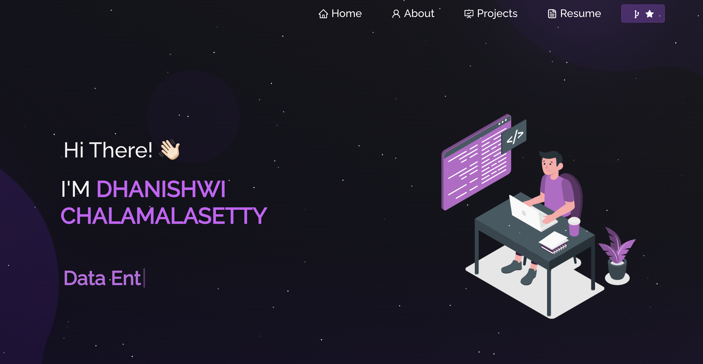

<h2 align="center">
  Portfolio Website  
  <a href="https://portfolio-amfq8kslb-dhanishwichs-projects.vercel.app/" target="_blank">Dhanishwi Ch</a>
</h2>

  

 

 &nbsp;
 &nbsp;
 &nbsp;
 &nbsp;

This project was built using these technologies.

- React.js
- Node.js
- Express.js
- CSS3
- VsCode
- Vercel

## Features

**📖 Multi-Page Layout**

**🎨 Styled with React-Bootstrap and Css with easy to customize colors**

**📱 Fully Responsive**

